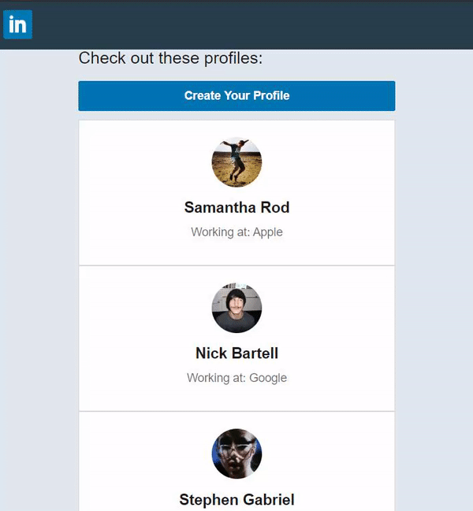
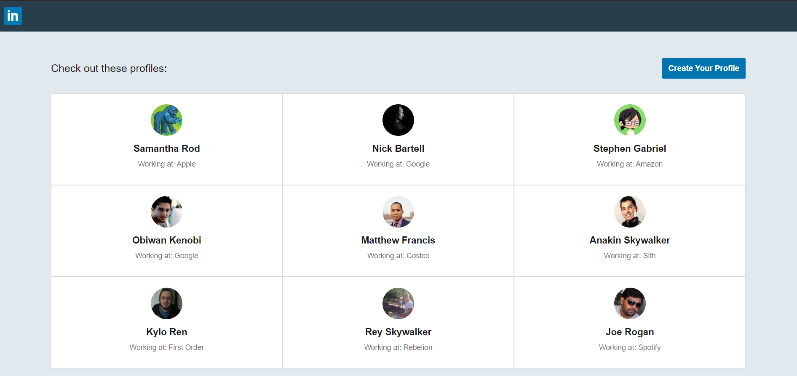
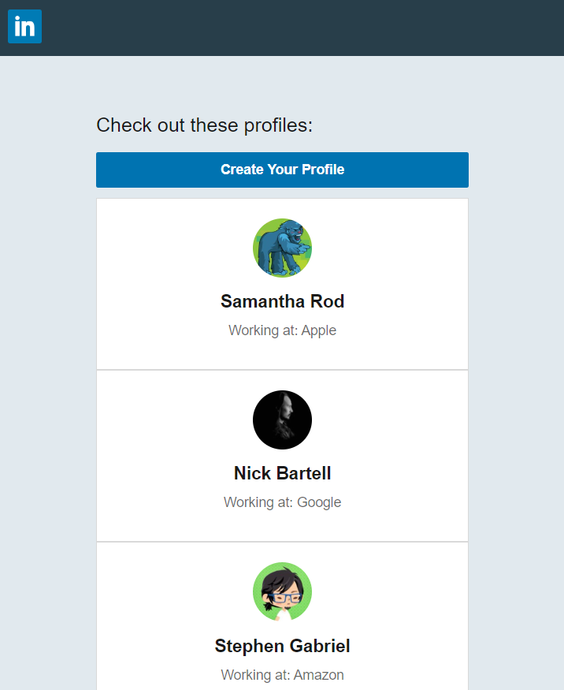
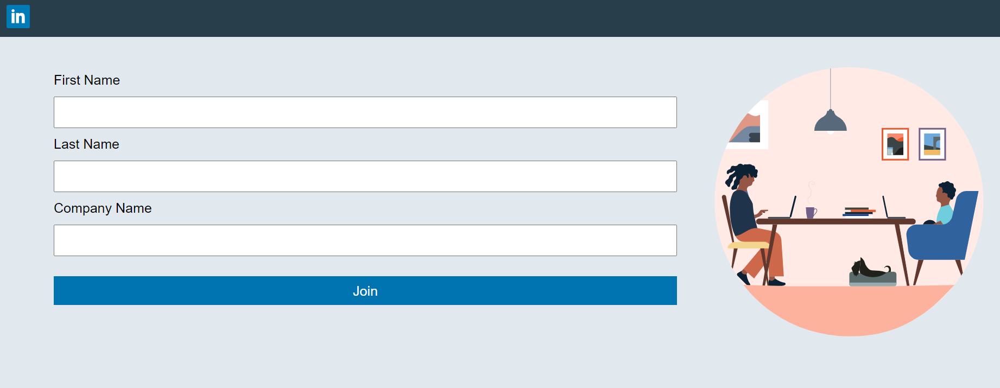
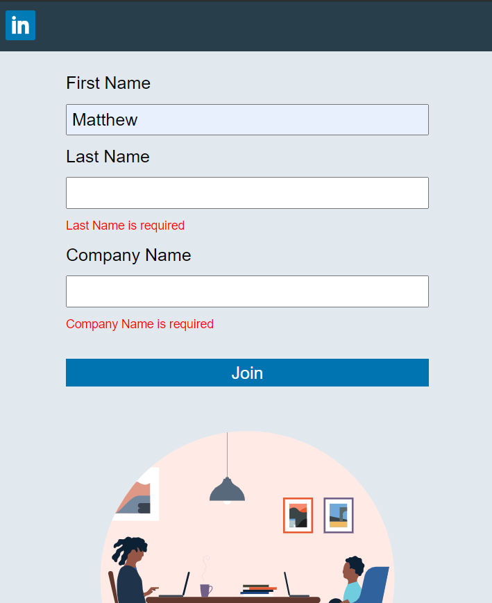

# Linkedin

Linkedin-like site where users can see other user's profiles and see what companies they work for. The user can also create their profile.

Developed with React, GraphQL, Express/Node.js, JS, HTML, CSS, [JSON-server for a JSON database and a server/API for REST requests](https://github.com/typicode/json-server)

For storage purposes, all data created will be stored temporarily in the database then it'll be automatically deleted after a certain amount of time.

To keep the project simple, avoided storing images in the database. Thus, used faker API to randomly generate profile pictures.

# Why I Built It and What I've Learned:

-   To understand how GraphQL is more suitable than RESTful Routing in certain cases.
-   To understand how Apollo "glues" React and GraphQL together. Apollo allows us to fetch data from our GraphQL server and implement it in React

*   In the project, we stopped at `users/id` but the intent of using GraphQL to avoid complicated REST routes while being able to get the data remains the same.

## GraphQL:

-   GrpahQL solves problems where different types of "data" is strongly related to each other, thus creating complicated/unconventional routes. For example,
    `users/1/friends/companies` would be a complicated REST route; `users/1/`friends_companies_and_position` would be a very specific REST route that breaks REST conventions due to the route getting more than 1 type of data after a "/". A solution to both would be to use GraphQL, by doing so we could get the data while maintaining a simple URL route.
-   GraphQL applies to both a relational and a NoSQL database. In the NoSQL approach, building a poorly designed route such as `users/1/friends/companies` is achievable by creating this structure in `JSON-Server's db.json` database:

```
{
  "users": [
    {
      "id": "1",
      "firstName": "Samantha",
      "lastName": "Skywalker",
      "company": "Apple,
      friends:[
           {
            "id": "2",
            "firstName": "Nick",
            "lastName": "Bartell",
            "age": 40,
            "company": "Google"
           },
           .... other friends
      ]
    },
    .... other users
    ]
}
```

-   Schemas are built so that we could make GraphQL commands.
-   GUI interface of GraphQL for testing GraphQL commands is generated in "/graphql" route.
-   `RootQueries` is used for the GET HTTP Method.
-   `Mutations` is used for PUT/POST/DELETE/PATCH HTTP Methods.
-   GraphQL allows us to decide what data we want to fetch. We don't need to fetch all the data. For example, using the above JSON data, we could create this GraphQL command to only get the firstName of users:
    ```
    {
         users {
             firstName
         }
     }
    ```

## Apollo:

-   GraphQL command queries should be stored and exported at their own files for reusability. For example, it is reusable with `refetchQueries`.
-   GraphQL command queries are called in a component with `const { loading, error, data } = useQuery(GQL_QUERY);`.
-   GraphQL command mutations are called in a component with `const [addUser] = useMutation(GQL_MUTATION);`.
-   When a mutation is finished, it is often accompanied by `refetchQueries` to update the component with the new data. It will execute any query in `refetchQuery` after the mutation is completed. This is done because after GraphQL initially calls a query, it will not call the query again until you refresh the page or `refetchQuery` is called. GraphQL is also smart enough to realize that the query should be called once; after `refetchQuery`, any other sources calling the query will be ignored.
-   A relevant idea to `refetchQueries`/updating the component with new data is `dataIdFromObject`, where you are updating your cache with newly added data to another data that has a unique id.

```
    const client = new ApolloClient({
    ...,
    cache: new InMemoryCache({
    ...,
    dataIdFromObject: object => object.id,
    }),
    });

```

## External resources:

-   Faker to generate random user profile pictures.
-   Prettier to format code and EsLint for linting.
-   JSON-server for a local database.

## What It Looks Like








# Getting Started

These instructions will get you a copy of the project up and running on your local machine for development and testing purposes.

1. Clone the project. Use `npm install` to install all the dependencies. Run the project with `npm start` for development or `npm run build` for production.

2. OPTIONAL: If you want to make changes locally, on the terminal, go to the `backend` directory. Type `start:json` to start the local JSON-server server/API which will connect the front-end to the database. Type `node run dev` to start the local GraphQL server, `server.js`.

# Prerequisites

What things you need to install the software

```

-   Any package manager (npm, yarn)

```

# Versioning

None
